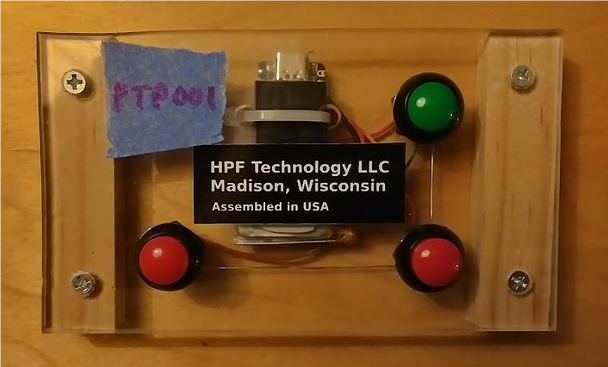
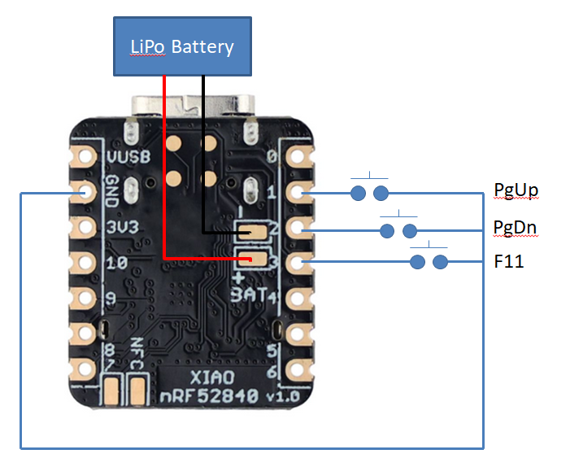
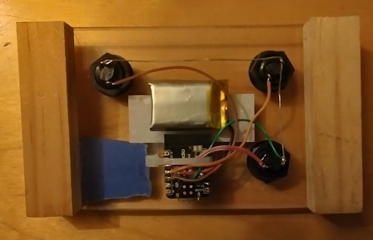

# Bluetooth page turning pedal based on nRF52840

Francis Deck, 8/1/2023

## Project status

Not ready for prime time. I've uploaded the source code file, but the documentation is under construction.

I re-designed the circuit becuse the old one, based on an ESP32 chip, had a roughly 2 hour battery life on a 300 mAh LiPo.

Compiling the firmware seems a bit problematic. If you're interested in making one of these, I suggest trying to compile the firmware on your computer before spending money on parts.

## Audience

Advanced hobbyists with electronics and programming skills. There is some hazard due to the LiPo battery, and getting the firmware programmed onto the microcontroller would take forever to document if you haven't done this kind of stuff before.

## Overview

A **page turning pedal** is a tool for musicians, to flip pages while reading sheet music on a tablet device. 

For the sake of non-musicians, "reading" specifically means "sight reading," where you play music directly from a written page. This is more important in some musical genres than others. If you play music that requires it, then fluency at sight-reading becomes a competitive skill.

Naturally, the music world has gone digital. You'll see more and more musicians with tablet devices -- iPads or whatever -- on their music stands. But flipping pages on a tablet while trying to play is awkward. A wireless pedal for flipping pages makes the tablet a lot easier to use in a performance or rehearsal.

Commercial pedals are available. If you depend on one for your job or reputation, it's best to buy one. I decided to see if I could build my own.

It emulates a Bluetooth keyboard with three buttons: Page-Up, Page-Down, and F11. The latter toggles full-screen mode on some PDF readers. It's powered by a rechargeable LiPo battery. 

The circuit consists of a Seeed XIAO nRF52840 microcontroller board, which has on-chip Bluetooth Low Energy (BLE) support, and a LiPo charger. So it's super convenient for low power wireless applications.

## Warning

Please read as much as you can about LiPo battery safety, and don't try to build one of these things unless you're qualified to make it safe. I happen to be an experienced electronic technician. Here is a tutorial on LiPo batteries:

https://learn.adafruit.com/li-ion-and-lipoly-batteries?view=all
	
My design uses a battery with built-in protection circuitry, not a "raw" cell. Also, I am extremely careful not to let the battery contacts touch one another while handling the battery or soldering its wires to the microcontroller board. Pay attention to the polarity.

Make sure the battery terminals can't be shorted if you store or transport the pedal.

## Schematic

This is it. All three pushbutton switches connect to a common ground. The battery connects to the battery terminals on the XIAO board. I used some hot-melt adhesive to secure the battery wires to the board after soldering.

Note that once connected, the board is "live" while you're doing the rest of the soldering. Touching your soldering iron to any terminal on the board will ground that terminal. I make sure that the entire board is isolated from ground while working on it.

## Firmware

Programming the firmware proved to be a little bit unpleasant. I plan on adding references to documentation... coming soon.

1. Install Arduino IDE:
	* https://docs.arduino.cc/software/ide-v2/tutorials/getting-started/ide-v2-downloading-and-installing
2. Install Seeeduino:
	* https://wiki.seeedstudio.com/XIAO_BLE/
	* Note that you have a choice in the Boards Manager for **Seeed nRF52 Boards** or **Seeed nRF52 mbed-enabled Boards**. Choose the one without mbed for this project.
3. Download and install this library:
	* https://github.com/cyborg5/BLE52_Mouse_and_Keyboard
	* Download it as a zip file
	* In the Arduino IDE do **Sketch -> Include library --> Add .ZIP library**
4. Load the btPgUpDn project into the Arduino IDE.
	* Choose Boards --> Seeed nRF52 Boards --> Seeed XIAO nRF52840 from the Tools menu
	* Try to compile (Ctrl-R). This might fail with errors or warnings. Warnings are OK, errors are not. I have found on a couple of instances, that compiling a second time was successful without error.
	* Try to upload (Ctrl-U). 
	* If upload is successful, the pedal will immediately go into sleep mode after flashing the red LED. You have to wake it back up if you want to reprogram it.
	
The firmware manages a number of different things, that are a little bit beyond basic Arduino programming.

1. **Bluetooth keyboard emulation**. The **BLE52_Mouse_and_Keyboard** library made this easy. I followed one of the code examples that came with the library, and dug into the library code to find out the constant names of the special function keys. *Lesson: Not everything is exhaustively documented. Sometimes the best documentation is to look at the library code. It's usually not too forbidding*.
2. **Low power sleep mode**. This forum thread was helpful, especially the comments from **daCoder**:
	* https://forum.seeedstudio.com/t/getting-lower-power-consumption-on-seeed-xiao-nrf52840/270129/2
	* The trick is the **INPUT_PULLUP_SENSE** mode for pins, and **NRF_POWER->SYSTEMOFF=1;**
3. **Managing the buttons.** I actually do not want this thing to behave exactly like a keyboard. Importantly, I don't want a "repeat" mode on the buttons, because there's no good use for flipping through a random number of pages during a musical performance. My routine adds a simple de-bounce delay on state changes, sets a bit for each button, and exits when all of the buttons have been released. It means that the buttons don't all have to be pressed at exactly the same time, which is impossible.
	

## Button operation

I didn't want to add more than just the button switches to my project, so the entire "user interface" is based on the buttons and the 3-color LED on the XIAO board. Of course you can experiment with different functionality. For now, I've implemented:

### Single button functions

* Page Up: Same as Page Up button on a keyboard, goes back one page in a PDF reader
* Page Down: Same as Page Down button on a keyboard
* F11: Same as F11 on a keyboard, toggles full-screen mode on most PDF readers.
* Pressing any single button while asleep triggers the battery indicator, which blinks the blue LED. More blinks is better, roughly 4 or maybe 5 blinks is best. (The calibration is not precise). It indicates the number of 0.1 Volt increments above 3.4 V.

### Multiple button functions

* PageDown and F11: Triggers the battery indicator
* All three buttons: Toggles low power sleep mode. I chose this combination because it's hard to accidentally press all three buttons, either while playing, or while the pedal is in your bag.

## Assembly

This isn't going to be a product. Mainly it needs to be stable enough to try out, and provide a way to test the firmware. The top is a piece of 3/16" Lexan sheet, an off-cut from making some window well covers for my house. The sides are scrap wood. Pro tip: I drill large holes in sheet materials with a Unibit, which is a stepped drill bit with multiple diameters in one bit. It's pretty inexpensive, leaves a very smooth hole, and doesn't "grab" when it cuts through to the other side of the workpiece.